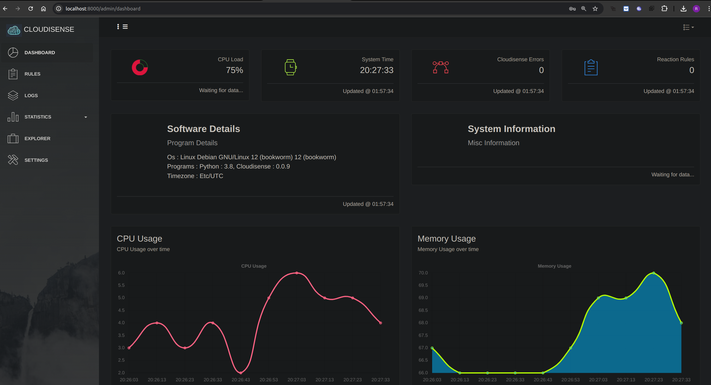
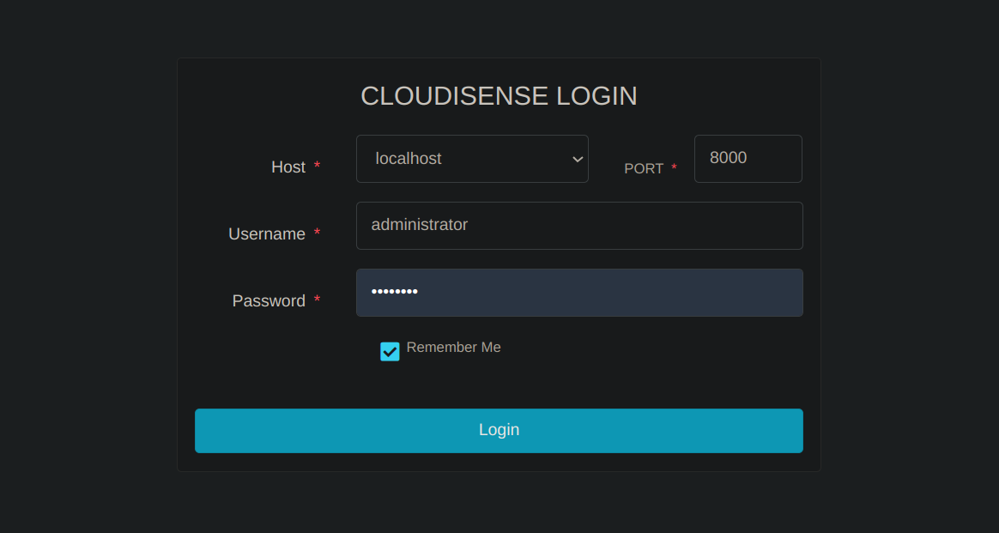
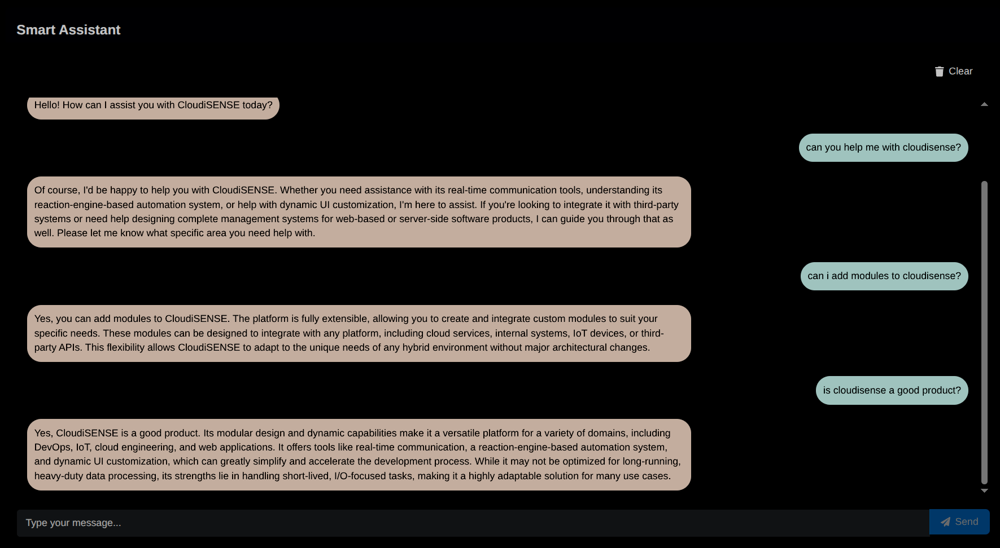

# Cloudisense demo on Docker




## Overview

This repository provides a **Dockerized setup** for **Cloudisense**, allowing for **easy deployment and execution**. It includes:

- A **Dockerfile** to build the Cloudisense image.
- A **Docker Compose file** (`docker-compose.yml`) to manage the containerized application.
- Configuration using **environment variables**.


## Docker Compose File (`docker-compose.yml`)

The `docker-compose.yml` file is used to **run the Cloudisense in a container** with demo configurations.


---

### Features

- Runs **Cloudisense Demo as a service**.
- Exposes **port `8000`**.
- Simulates dummy log generator to demonstrate **log viewer**.
- Demonstrates cloudisense **file browser**.
- Demonstrates **Stats viewer**.
- Demonstrates **Reaction engine**.
- Demonstrates **Smart Assistant** (OPENAI API key required).

---


### 🔹 Running the Container

To start the container using Docker Compose, run:

```bash
sudo docker-compose up -d
```

To stop the container:

```bash
sudo docker-compose down
```

To rebuild and restart:

```bash
sudo docker-compose up --build -d
```


---


## ⚙️ Environment Variables


| **Variable**                    | **Description**                                                                 | **Default Value**                                                                                          |
|--------------------------------|---------------------------------------------------------------------------------|-------------------------------------------------------------------------------------------------------------|
| `ENV_BIND_HOST`                | The host IP address the application binds to                                   | `0.0.0.0`                                                                                                   |
| `ENV_LOG_TARGETS`              | List of log files monitored by Cloudisense                                     | `[{"enabled": true, "name": "fakelog.log", "log_file_path": "/root/filesystem/logs/fakelog.log"}]`         |
| `ENV_ACCESSIBLE_PATHS`         | List of directories accessible via the file manager                            | `["/root/filesystem"]`                                                                                      |
| `ENV_DOWNLOADABLE_PATHS`       | List of directories from which files can be downloaded                         | `["/root/filesystem"]`                                                                                      |
| `ENV_OPENAI_API_KEY`           | String value representing the OpenAI API token for LLM features                | *(empty string by default)*                                                                                |
| `ENV_ALLOWED_READ_EXTENSIONS`  | Allowed file extensions for reading                                            | `[".properties", ".xml", ".txt", ".ini", ".log", ".sh", ".bat"]`                                            |
| `ENV_ALLOWED_WRITE_EXTENSIONS` | Allowed file extensions for writing                                            | `[".properties", ".xml", ".txt", ".ini", ".log"]`                                                           |


---


---

## Accessing Cloudisense in Browser




To **access Cloudisense client** in the browser, use:

```bash
http://localhost:8000
```


### **Login Form Demo Info**

- **Host:** `localhost`
- **Port:** `8000`
- **Default Username:** `administrator`
- **Default Password:** `changeme`


## 🧠 SmartAssist: AI-powered Assistant

SmartAssist is an integrated AI assistant in Cloudisense, powered by OpenAI.

- It can understand questions about system logs, modules, stats, and workflows.
- It uses the OpenAI API to provide intelligent summaries and suggestions.
- The assistant can be invoked from within the Cloudisense dashboard.
- Requires setting `ENV_OPENAI_API_KEY` in the environment to enable.



---


## Dockerfile

The `Dockerfile` is used to **build the Cloudisense Demo Docker image**, installing necessary dependencies, setting up logging, environment variables, and running the application.


### Steps in the Dockerfile

1. Uses **python:3.9-slim** as the base image.
2. Installs necessary tools (`git`).
3. **Clones the Cloudisense Installer Script** and executes it to install Cloudisense.
4. **Installs `cloudisensedemo` profile** to prepare the installation with demo-able content.
5. **Downloads and extracts Apache Tomcat 7.0.32** to `/root/filesystem` as a sample for directory browsing.
6. **Sets up a fake log generator** that continuously writes logs with random log levels (`INFO`, `WARN`, `DEBUG`, `ERROR`) to demonstrate log tailing in the browser.
7. **Defines default environment variables** for runtime demo configuration.
8. **Exposes port `8000`** for external access.
9. **Starts the log generator and the Cloudisense application**.


### 🔹 Building the Docker Image

To build the Docker image for cloudisense demo, run:

```bash

sudo docker buildx build \
  --platform linux/amd64,linux/arm64 \
  -t rajdeeprath/cloudisense:0.0.2 \
  -t rajdeeprath/cloudisense:latest \
  -f Dockerfile \
  --push .

```

---

## Locate on DockerHub

You can find the images [here](https://hub.docker.com/repository/docker/rajdeeprath/cloudisense/general) on Docker Hub.

---


## Debugging & Logs


To **view logs** from the running container:

```bash
sudo docker-compose logs -f
sudo docker-compose logs -f cloudisense
```


To check if **log generation is working**:

```bash
cat /root/filesystem/logs/fakelog.log
```


---


## Summary

- The **Dockerfile** builds an image containing **Cloudisense** and its dependencies.
- The **Docker Compose file** manages the container runtime with **environment variables and volumes**.
- **Fake logs are generated continuously**, and **all configurations can be overridden via environment variables**.
